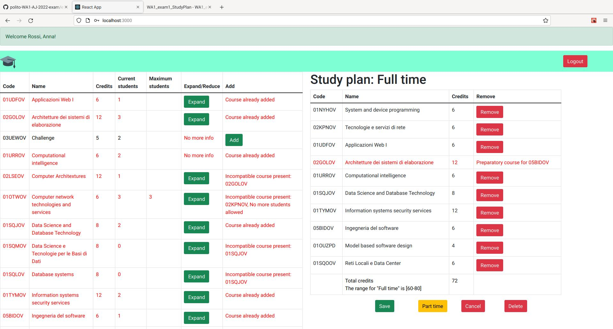

# Exam #1: "Study plan"
## Student: s303406 DAL POZZOLO CHRISTIAN

## React Client Application Routes

- Route `/` homepage of the application: it shows the course tables or forms accordingly to the way in which the user decided to access the page. In this page the user can edit her/his study plan, save it, delete it, creating one from scratch or simply browsing the available courses.
- Route `/login` login page which shows the form with the "username" and "password" fields and additional buttons that allows the user to confirm their credentials, reset the fields or simply access the homepage without any editing privileges. In this page the user can authenticate itself and she/he will be redirected to her/his own homepage.

## API Server

- GET `/api/v1/courses`
  - **request parameters**: None
  - **request body**: None
  - **response body**: \ 
  &nbsp;&nbsp;&nbsp;&nbsp;List of all courses in JSON format. \
  &nbsp;&nbsp;&nbsp;&nbsp;Each element is a JSON object corresponding to one course, having as fields the code, name, credits, current students, maximum students, incompatible courses, preparatory course. \
  &nbsp;&nbsp;&nbsp;&nbsp;The incompatible courses field is either null or a single string with one or multiple codes comma separated. \
  &nbsp;&nbsp;&nbsp;&nbsp;Also the maximum students and the preparatory course can be either null or some value(respectively a number and a string). \
  &nbsp;&nbsp;&nbsp;&nbsp;In case of error, the body is a JSON object describing the error through a string.

- GET `/api/v1/study_plan/:id`
  - **request parameters**:
  &nbsp;&nbsp;&nbsp;&nbsp;id is the identifier of a specific student in the student table.
  - **request body**:
  &nbsp;&nbsp;&nbsp;&nbsp;None
  - **response body**:
  &nbsp;&nbsp;&nbsp;&nbsp;A single JSON object containing 2 fields: the study plan type and the study plan itself. \
  &nbsp;&nbsp;&nbsp;&nbsp;Both of these 2 values can be NULL. \
  &nbsp;&nbsp;&nbsp;&nbsp;In case of error, the body is a JSON object describing the error through a string.

- POST `/api/v1/delete/:id`
  - **request parameters**:
  &nbsp;&nbsp;&nbsp;&nbsp;id is the identifier of a specific student in the student table.
  - **request body**: None
  - **response body**: \
  &nbsp;&nbsp;&nbsp;&nbsp;True (boolean value) \
  &nbsp;&nbsp;&nbsp;&nbsp;In case of error, the body is a JSON object describing the error through a string.

- POST `/api/v1/save/:id`
  - **request parameters**: \
  &nbsp;&nbsp;&nbsp;&nbsp;id is the identifier of a specific student in the student table.
  - **request body**: \
  &nbsp;&nbsp;&nbsp;&nbsp;A single JSON object containing the study plan type (string), the courses in the study plan (array of strings) and a flag which is not used
  - **response body**: \
  &nbsp;&nbsp;&nbsp;&nbsp;True (boolean value) \
  &nbsp;&nbsp;&nbsp;&nbsp;In case of error, the body is a JSON object describing the error through a string (generic error) or a string listing the courses violating the maximum students constraint.

- POST `/api/v1/update_courses`
  - **request parameters**: None
  - **request body**: \
  &nbsp;&nbsp;&nbsp;&nbsp;The full list of courses, characterized by all of their fields. \
  &nbsp;&nbsp;&nbsp;&nbsp;Used for writing the modifications in the database.
  - **response body**: \
  &nbsp;&nbsp;&nbsp;&nbsp;True (boolean value) \
  &nbsp;&nbsp;&nbsp;&nbsp;In case of error, the body is a JSON object describing the error through a string.

- GET `/sessions/current`
  - **request parameters**: None
  - **request body**: \
  &nbsp;&nbsp;&nbsp;&nbsp;None (JSON object with "username" and "password" is passed through the include)
  -- **response body**: \
  &nbsp;&nbsp;&nbsp;&nbsp;JSON object containing all the fields of a student. \
  &nbsp;&nbsp;&nbsp;&nbsp;In case of error, the body is a JSON object alerting the non authentication (as a string) .

- DELETE `/sessions/current`
  - **request parameters**: None
  - **request body**: \
  &nbsp;&nbsp;&nbsp;&nbsp;None
  -- **response body**: \ 
  &nbsp;&nbsp;&nbsp;&nbsp;None

- POST `/sessions`
  - **request parameters**: None
  - **request body**: \
  &nbsp;&nbsp;&nbsp;&nbsp;None (JSON object with "username" and "password" is passed through the include)
  - **response body**: \
  &nbsp;&nbsp;&nbsp;&nbsp;JSON object containing all the fields of a student.

## Database Tables

- Table `students` - contains the details of all students: 
  - student ID
  - student name
  - student surname
  - academic email
  - study plan type (Full-time or part-time, optional, can be NULL)
  - the study plan in the form of a list of codes separated by commas (optional, can be NULL)
    - This is not a very "elegant" design choice for a table. In fact it would probably have been way better to generate an additional table with fields (autoincremental_id, student_id, course_code) and then use it to retrieve the list of films belonging to a specific student. At least one advantage of my solution is that it should be faster in loading the study plan since the table size would be #students while in the other case we would need to scan through a table whose size would be O(#students * #courses)
  - the infos used to determine the password (hash and salt)
- Table `courses` - contains the full details of all courses: 
  - course code
  - course name
  - amount of credits
  - current amount of students enrolled (default 0)
  - maximum amount of students enrolled (optional, can be NULL: in this case there is no maximum)
  - incompatible course(s) in the form of a list of course codes separated by commas (optional, can be NULL)
  - at most 1 preparatory course, identified by its code (optional, can be NULL)

## Main React Components

- `LoginForm` (in `LoginForm.js`) It shows the form from which the user is able to access the course list. It contains 2 fields (username and password) and 3 buttons ("submit", "reset fields" and "access as a guest"). Its main functionality is to send the credential back to App.js in order to be processed/validated.
- `Home` (in `Home.js`) It represent the component which is shown when the user logs in or decides to access as a guest. It doesn't do anything by itself: it is used merely as a wrapper for other two subcomponent and it is a way to make the code cleaner.
- `NavigationBar` (in `NavigationBar.js`) It is used to render the navigation bar on top of the homepage (when the user access it in any way). Its main functionalities are to show the correct login/access message on top of the page, to add a (minimal) graphic element to the page and to allow the user to login (when in guest mode) or to logout (when logged in, also in this case all modification to the study plan are discarded). These two functionalities use a standard react bootstrap button component which redirects the user to the login page. 
- `CourseList` (in `CourseList.js`) It renders the page used to show the tables. It acts as a wrapper of sorts and includes the "lower level" table components. We can say that the only functionality of this component is to discriminate between different accesses: in addition to the standard full list of courses, it can ask to generate a full time/part time selection form for users without a study plan yet or it can render the study plan component if the user already has one. 
- `StandardTable` (in `StandardTable.js`) It is the table which is shown after a student access. It merely contains the full list of courses with all their informations. If a course has some incompatible or preparatory course the table shows an option to expand it to make these infos available to the user (and then it can be restored to its normal format with the newly appeared "Reduce" button), otherwise it prevents that by showing "No more infos". The courses that cannot be added in the logged user's study plan are highlighted in red. Also the header of the table implements a system that makes the table able to adapt itself to the new columns. If the user is modifying its study plan, additional informations are shows: an "Add" button if that course can be adder and an explanation why it cannot be added otherwise. In addition when a user adds a film in this way the "current students" field is increased by 1.
- `StudyPlanTypeChoice` (in `StudyPlanTypeChoice.js`) This component is located on the right of the standard table when the user is logged in but it doesn't have a study plan yet.For this reason it main purpose is to allow the user to choose a study plan type in order to know how to validate it in the future (even if it is possible to later switch from "part time" to "full time" and viceversa). It uses a simple "select form" and a submit button to get the user's choice and then sends it back to the App.js which will then trigger the presence of the next component in the homepage instead of this one.
- `StudyPlanTable` (in `StudyPlanTable.js`) This component is the most crucial as it controls the whole saving, deleting and client-side validating of the study plan. It shows a header at the top specifying the current study plan type and a table similar to the standard one, but this time it is filled with the courses present in the study plan of the logged user.The informations present in the table are only the code, the name and the credits, since I believe that the other ones are not required in this table (if a course already has the maximum number of students it just can't be added, there is no reason to show the fields on this table as well). If a course cannot be removed it is highlighted in red. In a similar fashion with respect to the standard table, also this table has a "remove" button, which deletes the course from the (temporary) study plan and decreases the value of the "current students" in the standard table by 1. Finally at the bottom there are 4 buttons: a "save" button to overwrite the study plan in the database, a "cancel" button which discards all the changes, a "delete" button which sets the study plan (and its type) to NULL in the database (effectively deleting them) and a button that allows the user to switch study plan type on the fly. After the user clicks one of the first 3 described buttons, it is immediatelly logged out after the potential changes.

## Screenshot

## Users Credentials

 (the password is "password" for all users)

- s000000, password
- s000001, password
- s000002, password
- s000003, password
- s000004, password
- s000005, password
